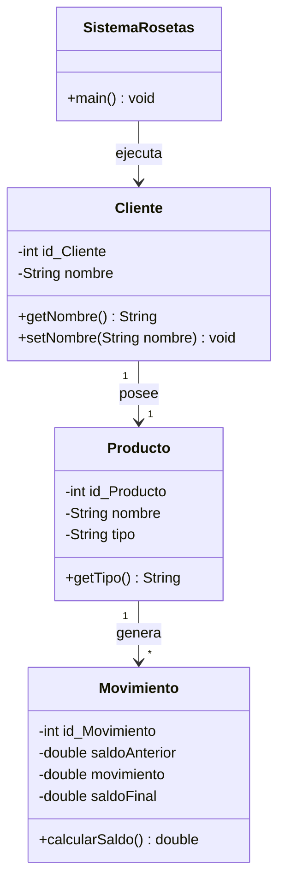

# Proyecto-Integrador

```mermaid
classDiagram

class Cliente {
    -int id_Cliente
    -String nombre
    +getNombre() String
    +setNombre(String nombre) void
}

class Producto {
    -int id_Producto
    -String nombre
    -String tipo
    +getTipo() String
}

class Movimiento {
    -int id_Movimiento
    -double saldoAnterior
    -double movimiento
    -double saldoFinal
    +calcularSaldo() double
}

class SistemaRosetas {
    +main() void
}

Cliente "1" --> "1" Producto : posee
Producto "1" --> "*" Movimiento : genera
SistemaRosetas --> Cliente : ejecuta

```